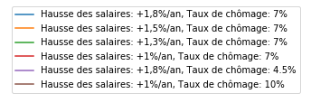

[](
    https://python.org)
[](
    https://opensource.org/licenses/gpl-license)
[](
    https://circleci.com/gh/mbaudin47/retraites)
[](
    https://mybinder.org/v2/gh/brunoscherrer/retraites/master?filepath=index.ipynb)

# Simulateur macroscopique du système de retraites

## Introduction


[données de projection du COR]: https://www.cor-retraites.fr/simulateur/fileProjection.json
[documentation technique fournie par le COR]: https://www.cor-retraites.fr/simulateur/img/pdf/Documentation_technique_vf.pdf
[SimulateurRetraites.py]: https://github.com/brunoscherrer/retraites/blob/master/retraites/SimulateurRetraites.py
[demo.py]: https://github.com/brunoscherrer/retraites/blob/master/demo.py
[fig]: https://github.com/brunoscherrer/retraites/blob/master/fig

Le COR (conseil d'orientation des retraites) a mis en ligne un simulateur pour permettre aux citoyens de simuler les effets macroscopiques des grandes lignes d'une réforme des retraites.
Ce projet vise a reproduire les résultats et à ajouter un certain nombre de fonctionnalités utiles, comme celui de proposer de concevoir une réforme à prestation définie (ex: calcul automatique des cotisations sociales pour avoir un système équilibré financièrement avec un certain niveau de vie pour les retraités et un age de départ fixé a priori).

On utilise les [données de projection du COR] et on se base sur la [documentation technique fournie par le COR].

## Implémentation

Les calculs sont faits dans la classe [SimulateurRetraites.py].

Le script [demo.py] est un script qui utilise [SimulateurRetraites.py] pour générer un certain nombre de figures, qu'on trouve dans le répertoire [fig].

## Publications

[D'après le COR, Macron & Philippe veulent vous faire travailler jusqu'à 68 ans, partie 1]: https://blogs.mediapart.fr/bruno-scherrer/blog/161219/dapres-le-cor-macron-philippe-veulent-vous-faire-travailler-jusqua-68-ans
[D'après le COR, Philippe vous donne la "liberté" de partir à 62 ans et d'être pauvre]: https://blogs.mediapart.fr/bruno-scherrer/blog/201219/dapres-le-cor-philippe-vous-donne-la-liberte-de-partir-62-ans-et-detre-pauvre
[D'après le COR, la réforme Philippe/Macron ne sera pas équilibrée financièrement]: https://blogs.mediapart.fr/bruno-scherrer/blog/030120/dapres-le-cor-la-reforme-philippemacron-ne-sera-pas-equilibree-financierement
[partie 2]: https://blogs.mediapart.fr/bruno-scherrer/blog/181219/dapres-le-cor-macron-philippe-veulent-vous-faire-travailler-jusqua-68-ans-2


Ce simulateur a été utile pour l'écriture de ces articles sur la réforme des retraites:

- [D'après le COR, Macron & Philippe veulent vous faire travailler jusqu'à 68 ans, partie 1] et [partie 2]
- [D'après le COR, Philippe vous donne la "liberté" de partir à 62 ans et d'être pauvre]
- [D'après le COR, la réforme Philippe/Macron ne sera pas équilibrée financièrement]

## Dépendances

Les dépendances sont :

- Python >= 3.4
- [numpy](http://www.numpy.org) >= 0.10
- [matplotlib](https://matplotlib.org) >= 1.5.3
- [scipy](https://www.scipy.org/) >= 1.0.0
- [openturns](https://openturns.github.io/openturns/latest/) >= 1.14

## Installation

L'installation se fait avec les commandes suivantes:

```
git clone https://github.com/brunoscherrer/retraites.git
cd retraites
python setup.py install
```

## Exemples de simulations

[intervention d'une vingtaine de minutes]: https://www.youtube.com/watch?v=f0EZ9KJmeLA&t=346s

Ci-dessous, nous suivons une suggestion de Michaël Zemmour (Université de Lille) faite lors d'une [intervention d'une vingtaine de minutes], c'est-à-dire d'expérimenter dans le même cadre macro-éconmique que le COR. 

On peut utiliser le code pour reproduire exactement les prévisions macroscopiques du simulateur du COR avec notamment les valeurs par défaut (celles d'un statu quo du système).
Cela permet de plus de calculer automatiquement les effets macroscopiques de réformes dont les cotisations seraient ajustées de sorte à équilibrer la situation financière du système. Ci-dessous, voici les prévisions du COR (sans aucune intervention) et deux exemples qui ont en commun de fixer comme objectif un niveau de vie des retraités égal à celui des actifs, le premier gardant les projections du COR en termes de départ à la retraite, le deuxième fixant un départ effectif à 61 ans. Les différentes courbes de couleurs à partir de 2020 correspondent aux différents scenarios conjoncturels (croissance/chômage) considérés par le COR à horizon 2070.

### Hypothèses macroéconomiques du COR

Les projections ci-dessous sont basées sur celles d'un certain nombre d'indicateurs macroscopiques fournis par le COR (voir la [documentation technique fournie par le COR] pour plus de détails), par exemple sur le fait qu'en 2070, un retraité moyen qui aurait une pension d'environ la moitié du salarié moyen aurait sensiblement le même niveau de vie.




### Simulation 1: Projections du COR avec le réglage initial


Dans cette première simulation, on observe une baisse légère des cotisations jusque 2070. Le système est globalement (en moyenne sur les différents scénarios conjoncturels) équilibré financièrement. Cet équilibre est possible via la baisse des pensions, de 0.5 fois le salaire moyen (2019) à une fourchette [0.25, 0.45] fois le salaire moyen selon la conjoncture. Le niveau de vie des retraités pourrait en être fortement affecté (jusqu'à une baisse de 30% dans le pire cas).

### Simulation 2: Adaptation automatique des cotisations


On voit qu'il suffit de prévoir une hausse légère de cotisations, précisément de 31% (aujourd'hui) à 35% (en 2070), c'est-à-dire en moyene +0.25% par an (vu que 1.0025^(2070-2020)=35/31) alors on peut dans le pire scenario assurer un niveau de vie aux retraités équivalent à celui des actifs et le système est équilibré.

### Simulation 3: Adaptation automatique des cotisations avec départ à 61 ans


Dans la troisième figure "Départ à 61 ans et cotisations adaptées", on peut mesurer ce que coûterait collectivement le fait de permettre aux français de partir (effectivement) à la retraite à 61 ans (ce qui correspond à une hypothèse d'un départ possible à 60%). Il faudrait alors porter l'effort de cotisations de 31% à 39% dans le pire cas conjoncturel, soit une augmentation moyenne par an de +0.46% des cotisations.

## Exemple d'utilisation

La classe ``SimulateurRetraites`` implémente le simulateur qui évalue les résultats 
du modèle en fonction des hypothèses (conjoncture) et des leviers. 
Cette classe implémente plusieurs stratégie de pilotage, la plus simple étant 
le pilotage du COR qui est évaluée grâce à la méthode ``pilotageCOR``. 
 
La méthode ``pilotageCOR`` retourne une instance de la classe ``SimulateurAnalyse``. 
Cette classe permet de produire les graphiques pour réaliser l'analyse 
des résultats. 

```
    from retraites.SimulateurRetraites import SimulateurRetraites
    simulateur = SimulateurRetraites()
    analyse = simulateur.pilotageCOR()
```

La méthode ``dessineSimulation`` permet de produire les graphiques standard dans l'analyse 
d'une stratégie de pilotage.

```
    analyse.dessineSimulation()
```

Le code précédent produit le graphique suivant.


## Documentation de l'API

L'interface de programmation est documentée avec des docstrings.

On y accède avec la fonction ``help``.

Par exemple, l'exemple suivant génère la documentation de la classe
``SimulateurRetraites``.

```
    from retraites.SimulateurRetraites import SimulateurRetraites
    help(SimulateurRetraites)
```

[Documentation de l'API]: https://github.com/brunoscherrer/retraites/blob/master/doc/API-doc.ipynb


La [Documentation de l'API] présente une version lisible de l'aide.

## Études réalisées avec le simulateur

[doc]: https://github.com/brunoscherrer/retraites/blob/master/doc
[Simulations numériques]: https://github.com/brunoscherrer/retraites/blob/master/index.ipynb
[Simulations numériques du rapport du COR de Juin 2019]: https://github.com/brunoscherrer/retraites/blob/master/doc/simulation-COR-juin-2019.ipynb
[Modèle du simulateur officiel du COR]: https://github.com/brunoscherrer/retraites/blob/master/doc/Description-du-composant-retraites.ipynb
[Essai de détermination des réformes possibles à partir de l'étude d'impact]: https://github.com/brunoscherrer/retraites/blob/master/doc/reformes.ipynb
[Une autre réforme en augmentant légèrement la part du PIB]: https://github.com/brunoscherrer/retraites/blob/master/doc/reformes2.ipynb
[Ce que l'étude d'impact ne dit pas]: https://github.com/brunoscherrer/retraites/blob/master/doc/Article4/article4-analyse-impact.pdf
[Simulations numériques de tous les pilotages possibles]: https://github.com/brunoscherrer/retraites/blob/master/doc/pilotages-possibles.ipynb
[Dessin de la naissance à la mort d'une génération]: https://github.com/brunoscherrer/retraites/blob/master/doc/Calcule-naissance-retraite-mort.ipynb
[Pilotage par la durée de vie en retraite]: https://github.com/brunoscherrer/retraites/blob/master/doc/pilotage-vie-en-retraite.ipynb
[Impact du déficit dans la trajectoire du COR de Juin 2019]: https://github.com/brunoscherrer/retraites/blob/master/doc/impact-deficit-COR-Juin-2019.ipynb


L'article "[Ce que l'étude d'impact ne dit pas]" présente une analyse détaillée de l'étude d'impact de Janvier 2020 réalisée à l'aide du simulateur.

La description du modèle mathématique est donnée dans le [Modèle du simulateur officiel du COR].

Un exemple complet d'utilisation du simulateur est présenté dans [Simulations numériques].

D'autres exemples sont présentés dans le répertoire [doc] :

- [Simulations numériques du rapport du COR de Juin 2019]
- [Simulations numériques de tous les pilotages possibles]
- [Essai de détermination des réformes possibles à partir de l'étude d'impact]
- [Une autre réforme en augmentant légèrement la part du PIB]
- [Dessin de la naissance à la mort d'une génération]
- [Pilotage par la durée de vie en retraite]
- [Impact du déficit dans la trajectoire du COR de Juin 2019]

[Simulations numériques de l'étude d'impact]: https://github.com/brunoscherrer/retraites/blob/master/doc/EtudeImpact/simulation-Etude-Impact.ipynb
[Essai de détermination des réformes possibles à partir de l'étude d'impact]: https://github.com/brunoscherrer/retraites/blob/master/doc/reforme-Macron-age-vs-pensions.ipynb
[Analyse de la trajectoire de l'âge de départ dans l'étude d'impact]: https://github.com/brunoscherrer/retraites/blob/master/doc/EtudeImpact/simulation-Etude-Impact-analyse-age.ipynb
[La réforme des retraites ne se fera pas à «budget constant»]: https://github.com/brunoscherrer/retraites/blob/master/doc/EtudeImpact/simulation-Etude-Impact-budget.ipynb
[Simulations numériques du rapport du COR de Juin 2019 - Calcul de pension annuelle (brut)]: https://github.com/brunoscherrer/retraites/blob/master/doc/EtudeImpact/CalculePensionAnnuelle/simulation-pension-annuelle.ipynb
[Numérisation de l'étude d'impact]: https://github.com/brunoscherrer/retraites/blob/master/doc/EtudeImpact/DigitalisationEI/Numerisation-Etude-Impact.ipynb
[Analyse de l'étude d'impact]: https://github.com/brunoscherrer/retraites/blob/master/doc/EtudeImpact/analyse-Etude-Impact.ipynb

Les résultats présentés dans "[Ce que l'étude d'impact ne dit pas]" proviennent des cahiers électroniques suivants :

- [Analyse de l'étude d'impact]
- [Simulations numériques de l'étude d'impact]
- [Essai de détermination des réformes possibles à partir de l'étude d'impact]
- [Analyse de la trajectoire de l'âge de départ dans l'étude d'impact]
- [La réforme des retraites ne se fera pas à «budget constant»]
- [Simulations numériques du rapport du COR de Juin 2019 - Calcul de pension annuelle (brut)]
- [Numérisation de l'étude d'impact]
