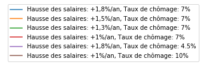

|Python|_ |License|_

.. image:: https://circleci.com/gh/mbaudin47/retraites.svg?style=svg
    :target: https://circleci.com/gh/mbaudin47/retraites

.. image:: https://mybinder.org/badge_logo.svg
 :target: https://mybinder.org/v2/gh/brunoscherrer/retraites/master?filepath=index.ipynb

.. |Python| image:: https://img.shields.io/badge/python-3.7-blue.svg
.. _Python: https://python.org

.. |License| image:: https://img.shields.io/github/license/brunoscherrer/retraites
.. _License: https://opensource.org/licenses/gpl-license

Simulateur macroscopique du système de retraites
================================================

Introduction
------------

.. _`données de projection du COR`: https://www.cor-retraites.fr/simulateur/fileProjection.json
.. _`documentation technique fournie par le COR`: https://www.cor-retraites.fr/simulateur/img/pdf/Documentation_technique_vf.pdf
.. _`SimulateurRetraites.py`: https://github.com/brunoscherrer/retraites/blob/master/retraites/SimulateurRetraites.py
.. _`demo.py`: https://github.com/brunoscherrer/retraites/blob/master/demo.py
.. _`fig`: https://github.com/brunoscherrer/retraites/blob/master/fig

Le COR (conseil d'orientation des retraites) a mis en ligne un simulateur pour permettre aux citoyens de simuler les effets macroscopiques des grandes lignes d'une réforme des retraites.
Ce projet vise a reproduire les résultats et à ajouter un certain nombre de fonctionnalités utiles, comme celui de proposer de concevoir une réforme à prestation définie (ex: calcul automatique des cotisations sociales pour avoir un système équilibré financièrement avec un certain niveau de vie pour les retraités et un age de départ fixé a priori).

On utilise les `données de projection du COR`_ et on se base sur la `documentation technique fournie par le COR`_.

Implémentation
--------------

Les calculs sont faits dans la classe `SimulateurRetraites.py`_.

Le script `demo.py`_ est un script qui utilise `SimulateurRetraites.py`_ pour générer un certain nombre de figures, qu'on trouve dans le répertoire `fig`_.

Publications
------------

.. _`D'après le COR, Macron & Philippe veulent vous faire travailler jusqu'à 68 ans, partie 1`: https://blogs.mediapart.fr/bruno-scherrer/blog/161219/dapres-le-cor-macron-philippe-veulent-vous-faire-travailler-jusqua-68-ans
.. _`D'après le COR, Philippe vous donne la "liberté" de partir à 62 ans et d'être pauvre`: https://blogs.mediapart.fr/bruno-scherrer/blog/201219/dapres-le-cor-philippe-vous-donne-la-liberte-de-partir-62-ans-et-detre-pauvre
.. _`D'après le COR, la réforme Philippe/Macron ne sera pas équilibrée financièrement`: https://blogs.mediapart.fr/bruno-scherrer/blog/030120/dapres-le-cor-la-reforme-philippemacron-ne-sera-pas-equilibree-financierement
.. _`partie 2`: https://blogs.mediapart.fr/bruno-scherrer/blog/181219/dapres-le-cor-macron-philippe-veulent-vous-faire-travailler-jusqua-68-ans-2

Ce simulateur a été utile pour l'écriture de ces articles sur la réforme des retraites:

- `D'après le COR, Macron & Philippe veulent vous faire travailler jusqu'à 68 ans, partie 1`_ et `partie 2`_
- `D'après le COR, Philippe vous donne la "liberté" de partir à 62 ans et d'être pauvre`_
- `D'après le COR, la réforme Philippe/Macron ne sera pas équilibrée financièrement`_

Dépendances
-----------

Les dépendances sont :

- Python >= 3.4
- `numpy <http://www.numpy.org>`_ >= 0.10
- `matplotlib <https://matplotlib.org>`_ >= 1.5.3
- `scipy <https://www.scipy.org/>`_ >= 1.0.0
- `openturns <https://openturns.github.io/openturns/latest/>`_ >= 1.14

Installation
------------

L'installation se fait avec les commandes suivantes::

    git clone https://github.com/brunoscherrer/retraites.git
    cd retraites
    python setup.py install

Exemples de simulations
-----------------------

.. _`intervention d'une vingtaine de minutes`: https://www.youtube.com/watch?v=f0EZ9KJmeLA&t=346s

Ci-dessous, nous suivons une suggestion de Michaël Zemmour (Université de Lille) faite lors d'une `intervention d'une vingtaine de minutes`_, c'est-à-dire d'expérimenter dans le même cadre macro-éconmique que le COR. 

On peut utiliser le code pour reproduire exactement les prévisions macroscopiques du simulateur du COR avec notamment les valeurs par défaut (celles d'un statu quo du système).
Cela permet de plus de calculer automatiquement les effets macroscopiques de réformes dont les cotisations seraient ajustées de sorte à équilibrer la situation financière du système. Ci-dessous, voici les prévisions du COR (sans aucune intervention) et deux exemples qui ont en commun de fixer comme objectif un niveau de vie des retraités égal à celui des actifs, le premier gardant les projections du COR en termes de départ à la retraite, le deuxième fixant un départ effectif à 61 ans. Les différentes courbes de couleurs à partir de 2020 correspondent aux différents scenarios conjoncturels (croissance/chômage) considérés par le COR à horizon 2070.

Hypothèses macroéconomiques du COR
^^^^^^^^^^^^^^^^^^^^^^^^^^^^^^^^^^

Les projections ci-dessous sont basées sur celles d'un certain nombre d'indicateurs macroscopiques fournis par le COR (voir la `documentation technique fournie par le COR`_ pour plus de détails), par exemple sur le fait qu'en 2070, un retraité moyen qui aurait une pension d'environ la moitié du salarié moyen aurait sensiblement le même niveau de vie.

.. image::  fig/conjoncture.jpg

Simulation 1: Projections du COR avec le réglage initial
^^^^^^^^^^^^^^^^^^^^^^^^^^^^^^^^^^^^^^^^^^^^^^^^^^^^^^^^

.. image::  fig/cor.jpg

Dans cette première simulation, on observe une baisse légère des cotisations jusque 2070. Le système est globalement (en moyenne sur les différents scénarios conjoncturels) équilibré financièrement. Cet équilibre est possible via la baisse des pensions, de 0.5 fois le salaire moyen (2019) à une fourchette [0.25, 0.45] fois le salaire moyen selon la conjoncture. Le niveau de vie des retraités pourrait en être fortement affecté (jusqu'à une baisse de 30% dans le pire cas).

Simulation 2: Adaptation automatique des cotisations
^^^^^^^^^^^^^^^^^^^^^^^^^^^^^^^^^^^^^^^^^^^^^^^^^^^^

.. image::  fig/cotisations.jpg

On voit qu'il suffit de prévoir une hausse légère de cotisations, précisément de 31% (aujourd'hui) à 35% (en 2070), c'est-à-dire en moyene +0.25% par an (vu que 1.0025^(2070-2020)=35/31) alors on peut dans le pire scenario assurer un niveau de vie aux retraités équivalent à celui des actifs et le système est équilibré.

Simulation 3: Adaptation automatique des cotisations avec départ à 61 ans
^^^^^^^^^^^^^^^^^^^^^^^^^^^^^^^^^^^^^^^^^^^^^^^^^^^^^^^^^^^^^^^^^^^^^^^^^

.. image::  fig/61ans.jpg

Dans la troisième figure "Départ à 61 ans et cotisations adaptées", on peut mesurer ce que coûterait collectivement le fait de permettre aux français de partir (effectivement) à la retraite à 61 ans (ce qui correspond à une hypothèse d'un départ possible à 60%). Il faudrait alors porter l'effort de cotisations de 31% à 39% dans le pire cas conjoncturel, soit une augmentation moyenne par an de +0.46% des cotisations.

Exemple d'utilisation
---------------------

La classe ``SimulateurRetraites`` implémente le simulateur qui évalue les résultats 
du modèle en fonction des hypothèses (conjoncture) et des leviers. 
Cette classe implémente plusieurs stratégie de pilotage, la plus simple étant 
le pilotage du COR qui est évaluée grâce à la méthode ``pilotageCOR``. 
 
La méthode ``pilotageCOR`` retourne une instance de la classe ``SimulateurAnalyse``. 
Cette classe permet de produire les graphiques pour réaliser l'analyse 
des résultats. 

.. code-block:: python

	from retraites.SimulateurRetraites import SimulateurRetraites
	simulateur = SimulateurRetraites()
	analyse = simulateur.pilotageCOR()

La méthode ``dessineSimulation`` permet de produire les graphiques standard dans l'analyse 
d'une stratégie de pilotage. 

.. code-block:: python

	analyse.dessineSimulation()

Le code précédent produit le graphique suivant. 

.. image::  fig/cor.jpg

Documentation
-------------

.. _`doc`: https://github.com/brunoscherrer/retraites/blob/master/doc
.. _`index`: https://github.com/brunoscherrer/retraites/blob/master/index.ipynb
.. _`SimulationCOR`: https://github.com/brunoscherrer/retraites/blob/master/doc/simulation-COR-juin-2019.ipynb
.. _`DocumentationModele`: https://github.com/brunoscherrer/retraites/blob/master/doc/Description-du-composant-retraites.ipynb
.. _`Reformes`: https://github.com/brunoscherrer/retraites/blob/master/doc/reformes.ipynb
.. _`Reformes2`: https://github.com/brunoscherrer/retraites/blob/master/doc/reformes2.ipynb
.. _`ArticleEI`: https://github.com/brunoscherrer/retraites/blob/master/doc/Article4/article4-analyse-impact.pdf
.. _`PilotagesPossibles`: https://github.com/brunoscherrer/retraites/blob/master/doc/pilotages-possibles.ipynb
.. _`NaissanceRetraiteMort`: https://github.com/brunoscherrer/retraites/blob/master/doc/Calcule-naissance-retraite-mort.ipynb

Le document `ArticleEI`_ présente une analyse détaillée de l'étude d'impact de Janvier 2020 réalisée à l'aide du simulateur :  *Ce que l'étude d'impact ne dit pas*.

La description du modèle mathématique est donnée dans `documentationModele`_. 

Un exemple complet d'utilisation du simulateur est présenté dans le fichier `index`_.

D'autres exemples sont présentés dans le répertoire `doc`_ :

- `SimulationCOR`_ : une simulation du rapport du COR de Juin 2019
- `PilotagesPossibles`_ : un exemple de tous les pilotages possibles
- `Reformes`_ : une simulation fondée sur l'étude d'impact
- `Reformes2`_ : une simulation fondée sur une modification de l'étude d'impact, avec augmentation des cotisations
- `NaissanceRetraiteMort`_ : une analyse génération par génération de la vie : naissance, retraite et mort

.. _`SimulationEtudeImpact`: https://github.com/brunoscherrer/retraites/blob/master/doc/simulation-Etude-Impact.ipynb
.. _`PossiblesEtudeImpact`: https://github.com/brunoscherrer/retraites/blob/master/doc/reforme-Macron-age-vs-pensions.ipynb
.. _`EtudeImpactAge`: https://github.com/brunoscherrer/retraites/blob/master/doc/simulation-Etude-Impact-analyse-age.ipynb
.. _`EtudeImpactDepenses`: https://github.com/brunoscherrer/retraites/blob/master/doc/simulation-Etude-Impact-budget.ipynb
.. _`EtudeImpactAgePensions`: https://github.com/brunoscherrer/retraites/blob/master/doc/reforme-Macron-age-vs-pensions.ipynb
.. _`EtudeImpactPensionAnnuelle`: https://github.com/brunoscherrer/retraites/blob/master/doc/CalculePensionAnnuelle/simulation-pension-annuelle.ipynb
.. _`EtudeImpactNumerisation`: https://github.com/brunoscherrer/retraites/blob/master/doc/DigitalisationEI/Numerisation-Etude-Impact.ipynb

Les résultats présentés dans l'`articleEI`_ proviennent des cahiers électroniques suivants :

- `SimulationEtudeImpact`_ : une simulation de l'étude d'impact de Janvier 2020
- `PossiblesEtudeImpact`_ : une représentation des trajectoires possibles dans le cadre de l'étude d'impact de Janvier 2020
- `EtudeImpactAge`_ : une analyse de la trajectoire d'âge de l'étude d'impact
- `EtudeImpactDepenses`_ : une analyse de la trajectoire de dépenses de l'étude d'impact
- `EtudeImpactAgePensions`_ : une analyse de l'étude d'impact en fonction de l'âge et du niveau de pensions
- `EtudeImpactPensionAnnuelle`_ : une analyse de l'étude d'impact en termes de pension annuelle
- `EtudeImpactNumerisation`_ : une numérisation de données de l'étude d'impact à partir des graphiques
